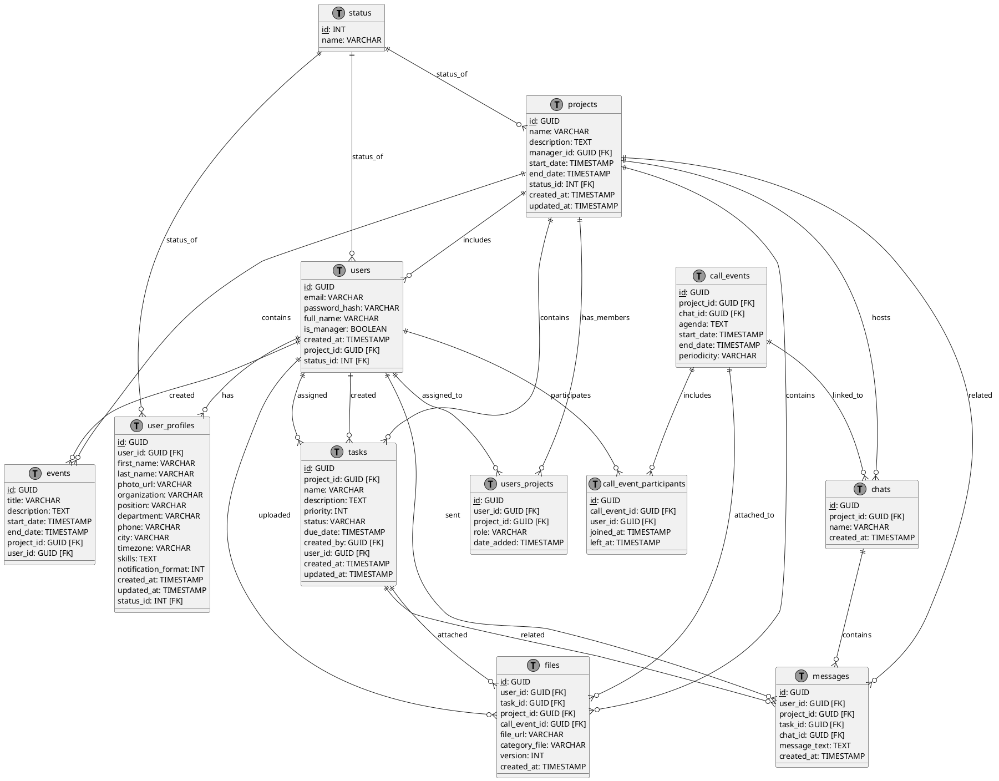
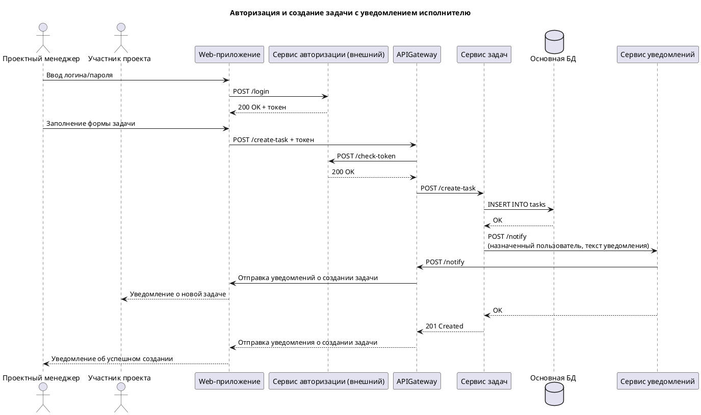
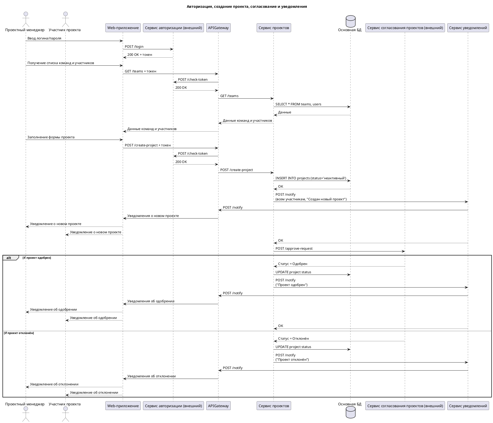

# Введение
Настоящая документация составлена с целью описания реализации подсистемы платформы онлайн-управления проектами и командной работы, предназначеной для менеджеров проектов и участников команд для обеспечения более эффективного взаимодействия, планирования задач и отслеживания прогресса. 

## Бизнес-процессы
#### Регистрация и создание профилей пользователей
**Участники**: менеджер проекта, член команды
**Компоненты**: платформа управления проектами 
**Триггер**: нажатие кнопки "Регистрация" пользователем на платформе
* Пользователь заполняет регистрационную форму следующими данными: ФИО, e-mail, роль (менеджер, участник команды), пароль;
* Пользователь подтверждает свой e-mail через осуществление перехода по ссылке, которую система отправила на указанный пользователем e-mail;
* Система после подтверждения пользователем своего e-mail адреса перенаправляет пользователя на главный экран система и предлагает пользователю завершить настройку своего профиля;
* Пользователь переходит в личный профиль и заполняет оставшиеся обязательные* и опциональные поля: наименование организации*, наименование структурного подразделения организации*, должность пользователя*, фотографию профиля, рабочий номер телефона, страну, город;
* Система после завершения настройки пользователем своего профиля предлагает пользователю начать работу - создать новый проект. 

#### Заполнение данных по проектам
**Участники**: менеджер проекта
**Компоненты**: подсистема платформы управления проектами 
**Триггер**: авторизованный пользователь с ролью "менеджер проекта" нажимает на кнопку "Создать новый проект"
* Менеджер проекта заполняет форму создания нового проекта данными по следующим полям: название проекта, описание проекта, назначение/цель проекта, планируемые сроки начала и окончания реализации, планируемый бюджет, выбор команды проекта (из ранее созданных на платформе), планируемое количество участников;
* Менеджер после заполнения формы создания нового проекта нажимает на кнопку "Создать", подтверждая создание нового проекта:
  * опционально менеджер может добавить вручную дополнительных участников проекта, не входящих в основную команду, ранее выбранной менеджером.
* Система осуществляет проверку введённых менеджером данных - в случае успешной проверки, создаёт новый проект и осуществляет отправку уведомлений о создании нового проекта всем участникам проекта.

#### Инструменты для создания и назначения задач, которые включают возможность устанавливать приоритеты, сроки и назначать ответственных
**Участники**: менеджер проекта, участник команды
**Компоненты**: подсистема платформы управления проектами 
**Триггер**: авторизованный менеджер / участник проекта выбрал проект в списке доступных текущих проектов и нажал на кнопку "Создать новую задачу"
* Менеджер / участник проекта заполняет форму создания новой задачи по следующим полям: название задачи, описание задачи, тип задачи ("эпик", "история", "подзадача"), планируемый сроки реализации, приоритет задачи ("срочный", "высокий", "средний", "низкий"), ответственный за исполнение (список участников команды проекта):
  * опционально менеджер / участник команды может осуществить привязку создаваемой задачи к уже существующей задаче (например, связать "историю" с "эпиком"), указать ссылку на существующую документацию, прикрепить файлы (типов: ".doc", ".txt", ".pdf", ".png", ".jpg", ".gif", ".mp4", ".xlsx", ".xls" и др.).
* Менеджер / участник проекта после заполнения формы создания новой задачи нажимает на кнопку "Создать", подтверждая создание новой задачи;
* Система осуществляет проверку введённых менеджером / участником проекта данных - в случае успешной проверки создаёт новую задачу с привязкой к текущему проекту и осуществляет отправку уведомления о создании новой задачи автору задачи и указанному исполнителю задачи.

#### Календарь для планирования встреч и сроков выполнения задач
**Участники**: менеджер проекта, участник команды
**Компоненты**: подсистема платформы управления проектами 
**Триггер**: авторизованный менеджер / участник проекта выбрал проект в списке доступных текущих проектов и нажал на вкладку "Календарь"
* Менеджер / участник проекта во вкладке "Календарь" формирует календарь для проведения регулярных встреч (например, для проведения дэйли, статуса по задачам и т.д.), встреч по конкретным задачам, стихийно возникающих встреч (например, для решения возникших ошибок):
  * менеджер / участник проекта при создании встречи указывают: адрес / место проведения встречи, дату и время проведения встречи, обязательных и необязательных участников встречи, описание цели проведения встречи;
  * менеджер / участник проекта дополнительно может прикрепить файлы (типов: ".doc", ".txt", ".pdf", ".png", ".jpg", ".gif", ".mp4", ".xlsx", ".xls" и др.) и сообщения почты к адженде встречи.
* Менеджер / участник проекта после формирования встречи нажимает на кнопку "Отправить";
* Система проверяет наличие пересекающихся встреч у всех участников встречи, регистрирует событие сформированной встречи и создаёт данное событие в календаре всех указанных участников встречи:  
  * пользователи, в чьих календарях существуют пересекающиеся по времени события, подсвечиваются системой для автора созданной встречи. 

#### Функционал для хранения документов и файлов
**Участники**: менеджер проекта, участник команды
**Компоненты**: подсистема платформы управления проектами 
**Триггер**: авторизованный менеджер / участник проекта выбрал проект в списке доступных текущих проектов и нажал на вкладку "Документы"
* Менеджер / участник проекта во вкладке "Документы" нажимает на кнопку "Создать" - в странице редактирования предоставляется возможность формирования документа с возможностью форматирования текста и добавления ссылок, таблиц, диаграмм, файлов (типов: ".doc", ".txt", ".pdf", ".png", ".jpg", ".gif", ".mp4", ".xlsx", ".xls" и др.), а также добавления различных макросов, расширяющих базовый функционал:
  * например, менеджер / участник проекта через макрос "Задача" может прилинковать ранее созданную задачу к создаваемому / редактируемому документу. 
* Менеджер / участник проекта нажимает на кнопку "Сохранить" с указанием заголовка документа:
  * менеджер / участник проекта может нажать на кнопку "Предпросмотр" для осуществления предварительного просмотра сформированного документа перед сохранением изменений.
* Система сохраняет сформированный документ в своей БД и отображает автора и дату последних изменений;
* Менеджер / участник проекта во вкладке "Документы" также может нажать на кнопку "Загрузить", чтобы осуществить загрузку уже готового документа с дальнейшей возможностью его редактирования;
* Система сохраняет загруженный документ в своей БД и отображает автора и дату последних изменений;  

#### Инструменты для общения и обсуждения, включая возможность создания чатов, обсуждений и видеозвонков прямо внутри платформы
**Участники**: менеджер проекта, участник команды
**Компоненты**: подсистема платформы управления проектами 
**Триггер**: авторизованный менеджер / участник проекта выбрал проект в списке доступных текущих проектов и нажал на вкладку "Чат"
* Менеджер / участник проекта во вкладке "Чат" и нажимает на кнопку "Создать новый чат" - в модальном окне создания менеджер / участник проекта вводит название чата и добавляет участников чата из списка возможных участников, далее - нажимает на кнопку "Создать"; 
* Система регистрирует новый чат и отправляет уведомление о добавлении всем указанным участникам чата;
* Менеджер / участник проекта в созданном чате может: отправить текстовое сообщение, добавить файлы (типов: ".doc", ".txt", ".pdf", ".png", ".jpg", ".gif", ".mp4", ".xlsx", ".xls" и др.), пригласить новых участников, исключить текущих участников, отправлять эмодзи, осуществить видеозвонок:
  * менеджер / участник проекта нажимает на иконку вызова для осуществления видеозвонка - перед выполнением вызова доступна возможность добавления / исключения необходимых участников встречи. После добавления нужных участников менеджер / участник проекта нажимает на кнопку "Вызов"; 
  * После нажатия на кнопку "Вызов" система регистрирует видеозвонок и отправляет уведомление всем участникам видеовстречи;
  * менеджер / участники проекта, которых добавили в видеовстречу, получают уведомление о встрече и имеют возможность подключиться к ней.
* Система сохраняет каждое сообщение из каждого чата и сохраняет данные по сессиям видеозвонков (участники, время начала и окончания проведения, продолжительность встречи, ссылка/место встречи, адженда встречи, прикреплённые файлы встречи).

## Заинтересованные стороны

| Должность                | Роль                      | Отдел               | Степень влияния | Интерес                                               | Доступные действия                                                           |
|--------------------------|-------------------------- |---------------------|-----------------|-------------------------------------------------------|------------------------------------------------------------------------------|
| Генеральный директор     | Стратегическое руководство| Руководство         | Критическая     | Общий контроль эффективности работы компании          | - Просмотр всех проектов<br>- Анализ KPI<br>- Доступ к финансовой аналитике  |
| Менеджер проектов        | Основной пользователь     | PMO                 | Высокая         | Упрощение планирования и контроля проектов            | - Создание/удаление проектов<br>- Назначение задач<br>- Контроль сроков      |
| HR-менеджер              | Администратор персонала   | HR                  | Высокая         | Мониторинг загрузки и вовлечённости сотрудников       | - Просмотр рабочих часов и профилей сотрудников<br>- Анализ загрузки         |
| Участник команды         | Исполнитель задач         | Разработка/Аналитика/Тестирование | Средняя | Эффективное выполнение поставленных задач       | - Работа с задачами<br>- Загрузка результатов<br>- Участие в обсуждениях     |
| Администратор системы    | Техподдержка              | IT                  | Высокая         | Стабильность и безопасность системы                   | - Управление пользователями<br>- Настройка прав<br>- Мониторинг системы      |
| Финансовый аналитик      | Контроль бюджетов         | Финансы             | Средняя         | Контроль расходов и рентабельности проектов           | - Просмотр бюджетов<br>- Формирование отчётов<br>- Анализ трудозатрат        |
| Внешний клиент           | Заказчик                  | -                   | Низкая          | Контроль выполнения своего проекта                    | - Просмотр статуса<br>- Комментарии к задачам<br>- Чтение документов         |
| Юрист                    | Контроль документов       | Юридический отдел   | Средняя         | Соблюдение нормативных требований                     | - Просмотр документов<br>- Утверждение шаблонов<br>- Контроль NDA            |
| Руководитель маркетинга  | Потребитель аналитики     | Маркетинг           | Средняя         | Использование данных для маркетинговых стратегий      | - Просмотр рыночных аналитик<br>- Запросы на исследования                    |
| Руководитель продукта    | Владелец продукта         | PMO                 | Высокая         | Контроль реализации продукта через проекты            | - Приоритизация задач<br>- Анализ прогресса<br>- Корректировка roadmap       |

## Требования к разрабатываемому функционалу
### Бизнес-требования

**Цель**: Обеспечение эффективного взаимодействия между менеджерами проектов и членами команд в контексте онлайн-управления проектами и командной работы.

**Задача**: Создание подсистемы для менеджеров проектов и членов команд, которая позволяет им более эффективно взаимодействовать, планировать задачи и отслеживать прогресс.

**Бизнес-требования**:
* Обеспечить централизованную платформу для взаимодействия между членами команды проекта для сокращения времени на коммуникацию и улучшения координации между ними;
* Обеспечить инструменты для планирования, распределения задач и мониторинга прогресса для своевременного выявления и устранения отклонений от плана;
* Обеспечить доступ к актуальной информации о состоянии проектов для всех заинтересованных сторон для реализации прозрачности и информированности всех заинтересованных сторон при принятии обоснованных решений. 

### Функциональные и нефункциональные требования
#### Тип требований - Функциональные

|Компонент                      |Модуль                                  |Описание                                                                                                                                                     |
|-------------------------------|----------------------------------------|-------------------------------------------------------------------------------------------------------------------------------------------------------------|
|Система                        |Управление профилями пользователей      |Создание и подтверждение личных профилей пользователей платформы: через использование e-mail, номеров телефона                                               |
|Система                        |Управление профилями пользователей      |Редактирование личных профилей пользователей платформы                                                                                                       |
|Система                        |Управление профилями пользователей      |Деактивация личных профилей пользователей платформы                                                                                                          |
|Система                        |Управление аутентификацией пользователей|Аутентификация и авторизация пользователей: использование логинов и паролей, управление ролями и правами доступа, двухфакторная аутентификация               |
|Система                        |Управление проектами                    |Работа с проектами, документацией и задачами платформы: создание, редактирование и удаление проектов и задач, определение приоритетов, определение исполнителей, определение сроков реализации, ведение документации, версионирование, загрузка готовой документации                                                                                                                      |
|Система                        |Управление проектами                    |Сохранение истории изменений действий пользователей с документацией и с задачами на платформе                                                                |
|Система                        |Управление проектами                    |Валидация введённых пользователями данных при создании проектов и задач                                                                                      |
|Система                        |Управление коммуникациями               |Работа с чатами и видеозвонками: создание чатов, виртуальные доски, совместные видеозвонки                                                                   |
|Система                        |Управление календарным временем         |Управление календарными событиями: планирование, определение участников, описание адженды, прикрепление необходимых материалов (PDF, DOCX, XLSX, PNG и др. - до 500 мб)                                                                                                                                                                                                                             |
|Система                        |Управление уведомлениями                |Показ уведомлений пользователям при работе с проектами, задачами, календарным расписанием (за 15/5 минут до начала), документацией                           |
|Менеджер проекта               |Управление проектами                    |Создание проектов с указанием описания проектов и участников                                                                                                 |
|Менеджер проекта и пользователь|Управление проектами                    |Создание задач с указанием описания задач и исполнителей, прикрепление файлов и документов различных форматов                                                |
|Менеджер проекта и пользователь|Управление коммуникациями               |Создание и ведение чатов с возможностью прикреплять файлы и документы различных форматов                                                                     |
|Менеджер проекта и пользователь|Управление коммуникациями               |Создание и назначение видеовстреч с возможностью указывать ключевых и неключевых участников (до 300 участников)                                              |
|Менеджер проекта и пользователь|Управление календарным временем         |Создание календарных событий с возможностью прикреплять файлы различных форматов и указывать ключевых и неключевых участников                                |
|Менеджер проекта и пользователь|Управление проектами                    |Создание и ведение документации с возможностью форматирования и загрузки готовых файлов и документов в различных форматах                                    |

#### Тип требований - Нефункциональные

| Тип требования                  | Описание                                                                                                                                                                       |
|---------------------------------|--------------------------------------------------------------------------------------------------------------------------------------------------------------------------------|
| **Надёжность и доступность**    | - Время безотказной работы ≥ 99.5% (класс SLA Silver)<br>- Максимальное время восстановления после сбоя: 1 час<br>- Автоматическое резервное копирование данных каждые 24 часа |
| **Безопасность**                | - Шифрование данных: TLS, AES-256<br>- Обязательная двухфакторная аутентификация<br>- Ролевая модель доступа (RBAC)<br>- Хэширование паролей                                   |
| **Производительность**          | - Время отклика интерфейса: ≤ 1.5 сек для 95% запросов<br>- Поддержка 500+ одновременных пользователей на 1 сервер<br>                                                         |
| **Удобство использования**      | - Удобный UI с минимальным временем обучения<br>- Единый UI-kit для всех модулей (Figma)<br>- Обеспечение поддержки использования UI людьми с ограниченными возможностями      |
| **Доступность и совместимость** | - Поддержка основных ОС: Windows, macOS, Linux<br>- Поддержка основных браузеров: Яндекс.Браузер, Google Chrome, Mozilla Firefox, Safary, Microsoft Edge                       |
| **Локализация**                 | - Поддержка 3 языков на старте (EN/RU/ZH)<br>- Локализация дат/времени по региону пользователя<br>                                                                             |
| **Поддержка и обслуживание**    | - Техническая поддержка 24/7 через чат и email (время ответа ≤ 15 мин)<br>- Ежеквартальные обновления функционала<br>                                                          |
| **Масштабируемость**            | - Горизонтальное масштабирование серверов при нагрузке >1000 пользователей<br>- Возможность добавления новых модулей без остановки системы                                     |
| **Интеграции**                  | - REST API для интеграций<br>- Webhook-уведомления для внешних систем<br>                                                                                                      |
| **Аналитика**                   | - Встроенная система сбора метрик (время выполнения задач, активность пользователей)<br>- Дашборды для менеджеров с KPI проектов                                               |

## Моделирование бизнес-процесса
Ссылка на просмотр изображения: 

## Моделирование структуры БД
### Код PlanUML



### Описание таблиц

#### status
| Поле | Тип     | Описание                         |
| ---- | ------- | -------------------------------- |
| id   | INT     | Уникальный идентификатор статуса |
| name | VARCHAR | Название статуса                 |

#### users
| Поле           | Тип       | Описание                               |
| -------------- | --------- | -------------------------------------- |
| id             | GUID      | Уникальный идентификатор пользователя  |
| email          | VARCHAR   | Адрес электронной почты                |
| password_hash  | VARCHAR   | Хэш пароля                             |
| full_name      | VARCHAR   | Полное имя                             |
| is_manager     | BOOLEAN   | Признак: является ли менеджером        |
| created_at     | TIMESTAMP | Дата и время создания записи           |
| project_id     | GUID      | ID проекта (FK)                        |
| status_id      | INT       | ID статуса пользователя (FK)           |

#### user_profiles
| Поле                | Тип       | Описание                          |
| --------------------| --------- | --------------------------------- |
| id                  | GUID      | Уникальный идентификатор профиля  |
| user_id             | GUID      | ID пользователя (FK)              |
| first_name          | VARCHAR   | Имя                               |
| last_name           | VARCHAR   | Фамилия                           |
| photo_url           | VARCHAR   | Ссылка на фото                    |
| organization        | VARCHAR   | Название организации              |
| position            | VARCHAR   | Должность                         |
| department          | VARCHAR   | Отдел                             |
| phone               | VARCHAR   | Номер телефона                    |
| city                | VARCHAR   | Город                             |
| timezone            | VARCHAR   | Часовой пояс                      |
| skills              | TEXT      | Навыки                            |
| notification_format | INT       | Формат уведомлений                |
| created_at          | TIMESTAMP | Дата создания профиля             |
| updated_at          | TIMESTAMP | Дата последнего обновления        |
| status_id           | INT       | ID статуса профиля (FK)           |

#### projects
| Поле        | Тип       | Описание                            |
| ----------- | --------- | ----------------------------------- |
| id          | GUID      | Уникальный идентификатор проекта    |
| name        | VARCHAR   | Название проекта                    |
| description | TEXT      | Описание проекта                    |
| manager_id  | GUID      | ID менеджера проекта (FK)           |
| start_date  | TIMESTAMP | Дата начала проекта                 | 
| end_date    | TIMESTAMP | Дата окончания проекта              |
| status_id   | INT       | ID статуса проекта (FK)             |
| created_at  | TIMESTAMP | Дата создания записи                |
| updated_at  | TIMESTAMP | Дата последнего обновления          |

#### user_projects
| Поле        | Тип       | Описание                              |
| ----------- | --------- | ------------------------------------- |
| id          | GUID      | Уникальный идентификатор записи       |
| user_id     | GUID      | ID пользователя (внешний ключ)        |
| project_id  | GUID      | ID проекта (внешний ключ)             |
| role        | VARCHAR   | Роль пользователя в проекте           |
| date_added  | TIMESTAMP | Дата добавления пользователя в проект |

#### tasks
| Поле        | Тип       | Описание                             |
| ----------- | --------- | ------------------------------------ |
| id          | GUID      | Уникальный идентификатор задачи      |
| project_id  | GUID      | ID проекта (FK)                      |
| name        | VARCHAR   | Название задачи                      |
| description | TEXT      | Описание задачи                      |
| priority    | INT       | Приоритет задачи                     |
| status      | VARCHAR   | Статус задачи                        |
| due_date    | TIMESTAMP | Срок выполнения                      |
| created_by  | GUID      | ID создателя задачи (FK)             |
| user_id     | GUID      | ID исполнителя задачи (FK)           |
| created_at  | TIMESTAMP | Дата создания задачи                 |
| updated_at  | TIMESTAMP | Дата последнего обновления задачи    |

#### files
| Поле            | Тип       | Описание                                 |
| --------------- | --------- | ---------------------------------------- |
| id              | GUID      | Уникальный идентификатор файла           |
| user_id         | GUID      | ID пользователя, загрузившего файл (FK)  |
| task_id         | GUID      | ID задачи, к которой относится файл (FK) |
| project_id      | GUID      | ID проекта (FK)                          |
| call_event_id   | GUID      | ID мероприятия (если оно было, FK)       |
| file_url        | VARCHAR   | Ссылка на файл                           |
| category_file   | VARCHAR   | Категория файла                          |
| version         | INT       | Версия файла                             |
| created_at      | TIMESTAMP | Дата загрузки                            |

#### events
| Поле        | Тип       | Описание                            |
| ----------- | --------- | ----------------------------------- |
| id          | GUID      | Уникальный идентификатор события    |
| title       | VARCHAR   | Название события                    |
| description | TEXT      | Описание события                    |
| start_date  | TIMESTAMP | Дата и время начала                 |
| end_date    | TIMESTAMP | Дата и время окончания              |
| project_id  | GUID      | ID проекта (FK)                     |
| user_id     | GUID      | ID создателя события (FK)           |

#### chats
| Поле        | Тип       | Описание                                  |
| ----------- | --------- | ----------------------------------------- |
| id          | GUID      | Уникальный идентификатор чата             |
| project_id  | GUID      | ID проекта, к которому относится чат (FK) |
| name        | VARCHAR   | Название чата                             |
| created_at  | TIMESTAMP | Дата создания                             |

#### messages
| Поле          | Тип       | Описание                           |
| ------------- | --------- | ---------------------------------- |
| id            | GUID      | Уникальный идентификатор сообщения |
| user_id       | GUID      | ID отправителя сообщения (FK)      |
| project_id    | GUID      | ID проекта (FK)                    |
| task_id       | GUID      | ID задачи (FK)                     |
| chat_id       | GUID      | ID чата (FK)                       |
| message_text  | TEXT      | Текст сообщения                    |
| created_at    | TIMESTAMP | Дата отправки                      |

#### call_events
| Поле        | Тип       | Описание                             |
| ----------- | --------- | ------------------------------------ |
| id          | GUID      | Уникальный идентификатор мероприятия |
| project_id  | GUID      | ID проекта (FK)                      |
| chat_id     | GUID      | ID чата (FK)                         |
| agenda      | TEXT      | Повестка мероприятия                 |
| start_date  | TIMESTAMP | Дата и время начала                  |
| end_date    | TIMESTAMP | Дата и время окончания               |
| periodicity | VARCHAR   | Периодичность мероприятия            |

#### call_event_participants
| Поле            | Тип       | Описание                           |
| --------------- | --------- | ---------------------------------- |
| id              | GUID      | Уникальный идентификатор участника |
| call_event_id   | GUID      | ID мероприятия (FK)                |
| user_id         | GUID      | ID пользователя платформы (FK)     |
| joined_at       | TIMESTAMP | Время подключения к мероприятию    |
| left_at         | TIMESTAMP | Время выхода из мероприятия        |


### Визуализация диаграммы
Ссылка на просмотр изображения: 


## Моделирование архитектуры системы
### C4 - Диаграмма контекста
#### Код PlantUML
```plantuml
@startuml
!includeurl https://raw.githubusercontent.com/plantuml-stdlib/C4-PlantUML/master/C4_Context.puml

title C4 Контекст: Система управления проектами

' Роли и внешние пользователи
Person(pm, "Проектный менеджер", "Создаёт/редактирует проекты, управляет задачами, календарём и чатами")
Person(member, "Участник проекта", "Управляет задачами, календарём, профилем, чатами")
Person_Ext(projectApprover, "Руководитель проекта", "Утверждает или отклоняет проект")
Person_Ext(adminUser, "Администратор", "Управляет ролями и доступом")

' Внешние системы
System_Ext(adminService, "Сервис авторизации", "Проверяет и выдаёт права доступа")
System_Ext(approvalService, "Сервис согласования проектов", "Утверждает или отклоняет проекты")

' Внутренняя система
System_Boundary(system, "Система управления проектами") {
    System(apiGateway, "API Gateway", "Единая точка входа")
    System(userService, "Сервис учёта пользователей", "")
    System(projectService, "Сервис проектов", "")
    System(taskService, "Сервис задач", "")
    System(calendarService, "Сервис календаря", "")
    System(chatService, "Сервис коммуникаций", "")
    System(documentService, "Сервис документации", "")
}

' Взаимодействия
pm --> apiGateway : Создание/редактирование проектов,\nпрофилей, задач, календаря, чатов
member --> apiGateway : Управление задачами,\nкалендарём, чатами, профилем

apiGateway --> userService : API-запросы
apiGateway --> projectService : API-запросы
apiGateway --> taskService : API-запросы
apiGateway --> calendarService : API-запросы
apiGateway --> chatService : API-запросы
apiGateway --> documentService : API-запросы

projectService --> approvalService : Отправка на согласование
approvalService --> projectApprover : Утверждение/отклонение

adminUser --> adminService : Управление ролями
apiGateway --> adminService : Проверка прав

@enduml
```
#### Визуализация диаграммы
Ссылка на просмотр изображения: 

### C4 - Диаграмма контейнеров
#### Код PlantUML
```plantuml
@startuml
!includeurl https://raw.githubusercontent.com/plantuml-stdlib/C4-PlantUML/master/C4_Container.puml

title C4 Контейнеры: Система управления проектами

' Роли
Person(pm, "Проектный менеджер")
Person(member, "Участник проекта")

' Внешняя система: Сервис авторизации
System_Ext(adminService, "Сервис авторизации", "Проверяет и выдаёт права доступа") {
    Person(adminUser, "Администратор")
    Container(authAPI, "API авторизации", "REST API", "Управление пользователями и правами")
    ContainerDb(authDB, "БД авторизации", "PostgreSQL", "Роли, логины, доступ")
    adminUser --> authAPI : Управление пользователями и ролями
    authAPI --> authDB : Чтение / Запись
}

' Внешняя система: Сервис согласования проектов
System_Ext(approvalService, "Сервис согласования проектов", "Утверждает или отклоняет проекты") {
    Person(projectApprover, "Руководитель проекта")
    Container(approvalAPI, "API согласования", "REST API", "Обработка заявок на проекты")
    ContainerDb(approvalDB, "БД согласования", "PostgreSQL", "Данные по заявкам")
    projectApprover --> approvalAPI : Утверждение или отклонение
    approvalAPI --> approvalDB : Чтение / Запись
}

' Основная система
Container_Boundary(core, "Система управления проектами") {
    Container(webUI, "Web-приложение", "JavaScript", "Интерфейс пользователя")

    Container(apiGateway, "API Gateway", "Nginx/Node.js", "Маршрутизирует API-запросы")

    Container(userService, "Сервис учёта пользователей", "Node.js", "Управление профилями")
    Container(projectService, "Сервис проектов", "Node.js", "Создание/редактирование проектов")
    Container(taskService, "Сервис задач", "Node.js", "Управление задачами")
    Container(calendarService, "Сервис календаря", "Node.js", "Планирование событий")
    Container(chatService, "Сервис коммуникаций", "Node.js", "Обмен сообщениями")
    Container(documentService, "Сервис документации", "Node.js", "Хранение файлов")

    ContainerDb(mainDB, "Основная БД", "PostgreSQL", "Данные пользователей, задач, проектов и чатов")
    ContainerDb(docDB, "Хранилище документов", "S3 или MinIO", "Документы и метаданные")
}

' Взаимодействия
pm --> webUI : Создание/редактирование проектов, профилей, задач, календарей, чатов
member --> webUI : Управление задачами, календарями, чатами, профилем
webUI --> apiGateway : REST

apiGateway --> userService : API-запросы
apiGateway --> projectService : API-запросы
apiGateway --> taskService : API-запросы
apiGateway --> calendarService : API-запросы
apiGateway --> chatService : API-запросы
apiGateway --> documentService : API-запросы
apiGateway --> authAPI : Проверка доступа

projectService --> approvalAPI : Отправка проектов на согласование

userService --> mainDB : Чтение / Запись
projectService --> mainDB : Чтение / Запись
taskService --> mainDB : Чтение / Запись
calendarService --> mainDB : Чтение / Запись
chatService --> mainDB : Чтение / Запись
documentService --> docDB : Чтение / Запись

@enduml
```
#### Визуализация диаграммы
Ссылка на просмотр изображения: 

## Моделирование взаимодействия компонентов системы
### Sequence-диаграмма №1 - Создание задачи
#### Код PlantUML

#### Визуализация диаграммы
Ссылка на просмотр изображения: 

### Sequence-диаграмма №2 - Создание проекта
#### Код PlantUML

#### Визуализация диаграммы
Ссылка на просмотр изображения: 
